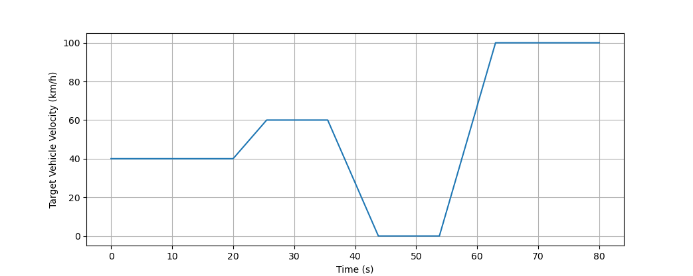

# Interview Case - Simple Adaptive Cruise Control (ACC)

Note: The following assignment should be viewed as a simplified development case, where you do not have to consider all the complexities which the real development at Lightyear would otherwise involve. The task is not intended to keep you busy for a long time. If there are things that you believe are important that are missing or wrong and that you would (suggest to) do if this was a real-life task where you had more time, please feel free to add these points as remarks in your documentation!

## Environment

We assume you have an environment in which you can use git/g++. Please have a look at this repo and all the files that it contains.

## Functional description

Consider an ego vehicle which is traveling on a straight road with a single lane (no overtaking is possible) and a target vehicle in front.

    

You are asked to implement part of a basic control system which calculates the acceleration setpoints for the ego vehicle. The control system's aim is to track the set velocity from the driver (which is an input) unless this is prevented by a target vehicle in front. If the target vehicle is preventing the ego vehicle from driving at the set velocity, a target time gap of 2 seconds to the target vehicle should instead be tracked. For the purpose of this task, the time gap is defined as the distance to the target vehicle (in meters) divided by the ego vehicle's velocity (in meters per second). The acceleration cannot exceed 5 m/s2 and the deceleration also cannot exceed 5 m/s2. Furthermore, the distance to the target vehicle should never be shorter than 2 meters.

For this task, you can assume the following input signals are available: 
- Ego vehicle velocity (m/s) 
- Ego vehicle acceleration (m/s2) 
- Set velocity from the driver (m/s) 
- Distance to the target vehicle (see figure) (m)
- Velocity of the target vehicle (m/s)

To test your control system, simulate the scenario which has already been implemented in the provided environment (main.cpp). The environment already includes a model which calculates the ego vehicle motion (travel distance, velocity and acceleration) based on your controller's acceleration setpoints. The environment also includes the definition of the target vehicle's motion over the scenario. The initial distance to the target vehicle is 100 meters with a velocity profile as shown in the following figure.

    

Once you have implemented your control system, write the results as a time series to a space-delimited output file as shown in 'data/results.dat'. The first five columns of this results file should be the time (s), the ego vehicle velocity (m/s), the ego vehicle acceleration (m/s2), the acceleration setpoint (m/s2) and the distance to the target vehicle (m), respectively.

## What do you have to do?

1. Using git, create a feature branch on which you can make your changes named “feature/yyyy_mm_dd_your_first_name” on which you commit your changes.
2. Describe your “high level” design in doc/mainpage.dox (doxygen style). If you want to add diagrams you can use whatever tool you like, e.g. plantUML or draw.io.
3. Create the associated C++ code in src/ and include/.
4. Document your code (everything in English) using the doxygen style. Examples can be found in the already existing code.
5. When you are done, please commit your changes, zip the repo and send it back.

The following g++ build command (called from the root directory) might come in handy: 
- `g++ src/*.cpp -Iinclude -o main`

Good luck!
